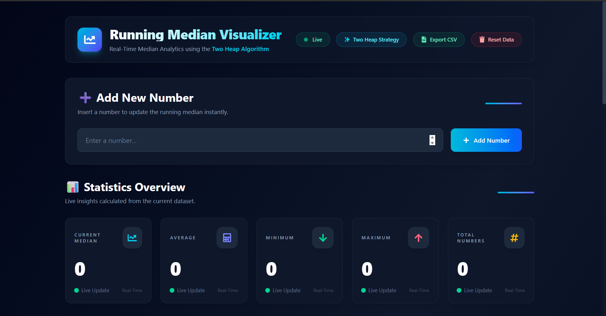
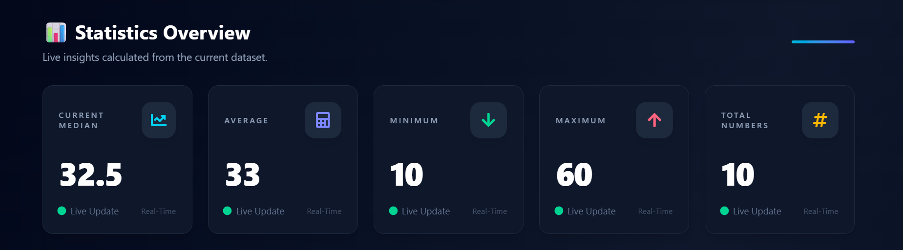
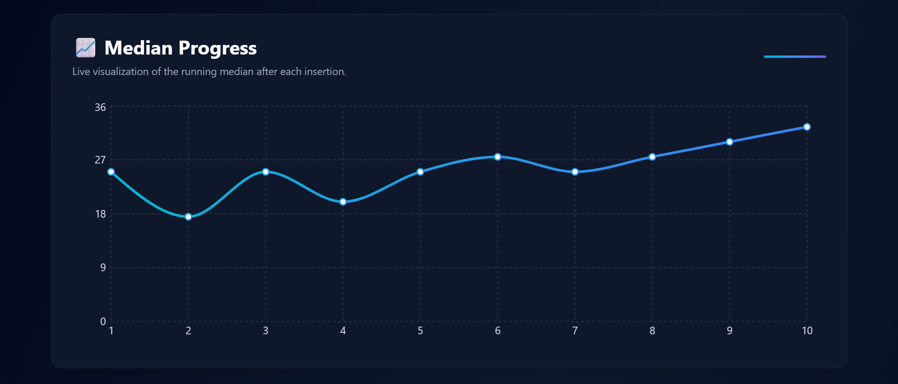
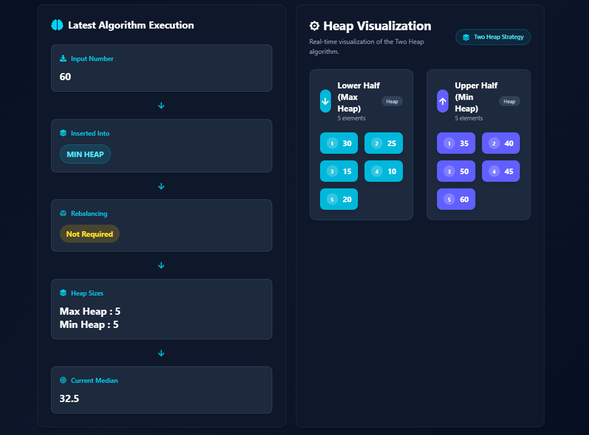
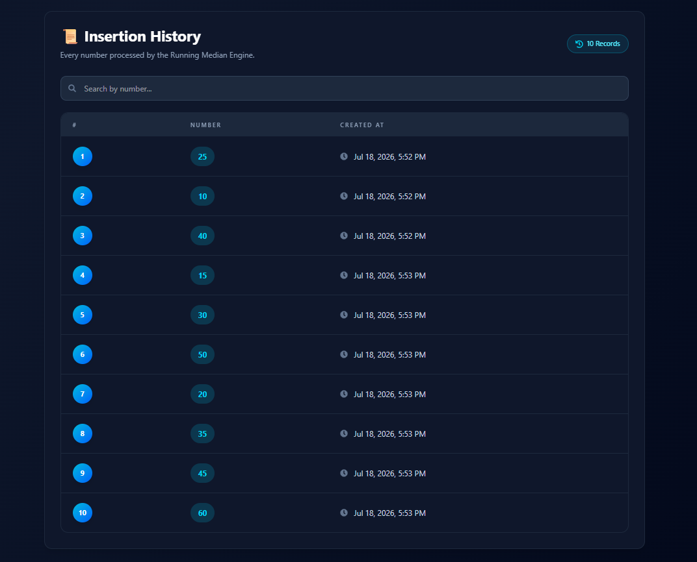
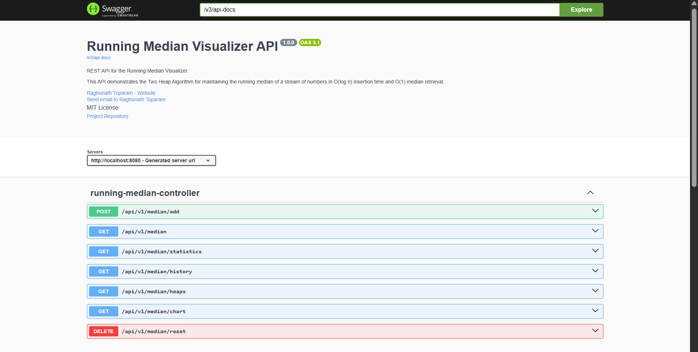

# 🚀 Running Median Visualizer

<p align="center">


</p>

<p align="center">

A full-stack web application that visualizes the **Running Median** algorithm using the **Two Heap Strategy (Max Heap + Min Heap)**. The project provides real-time median calculation, heap visualization, execution tracking, statistical analysis, interactive charts, and REST APIs built with **Spring Boot** and a responsive frontend developed using **React**.

</p>

---

# 🌐 Live Demo

### 🚀 Frontend (Vercel)

https://running-median-visualizer.vercel.app

### 📚 Backend API (Swagger)

https://runningmedian-backend.onrender.com/swagger-ui/index.html

---

# 📸 Project Preview

## Dashboard



---

## 📊 Statistics Overview



---

## 📈 Median Progress



---

## 🧠 Algorithm Execution & Heap Visualization



---

## 📜 Insertion History



---

## 📚 Swagger API Documentation



---

# ✨ Features

## Backend

- Running Median using the Two Heap Algorithm
- O(log n) insertion
- O(1) median retrieval
- Spring Boot REST APIs
- H2 Database
- Spring Data JPA
- Global Exception Handling
- Bean Validation
- Layered Architecture
- OpenAPI / Swagger Documentation
- Dockerized Backend
- Cloud Deployment on Render

---

## Frontend

- Modern Dashboard UI
- Live Statistics
- Median Progress Chart
- Heap Visualization
- Algorithm Execution Timeline
- Searchable History
- CSV Export
- Reset Dataset
- Responsive Design
- Smooth Animations using Framer Motion
- Cloud Deployment on Vercel

---

# 🏗 Architecture

```
                 React + Vite
                       │
                       ▼
              REST API (Spring Boot)
                       │
          ---------------------------
          │                         │
          ▼                         ▼
 RunningMedianEngine          H2 Database
 (Two Heap Algorithm)
          │
   Max Heap + Min Heap
```

---

# ⚡ Two Heap Algorithm

The application maintains the running median using two priority queues.

### Max Heap

Stores the lower half of the numbers.

### Min Heap

Stores the upper half of the numbers.

After every insertion:

1. Insert into the appropriate heap.
2. Rebalance the heaps if required.
3. Calculate the current median.
4. Update the dashboard, statistics, and chart instantly.

## Time Complexity

| Operation | Complexity |
|-----------|-----------:|
| Insert Number | O(log n) |
| Get Median | O(1) |
| Rebalancing | O(log n) |

---

# 🛠 Tech Stack

## Backend

- Java 21
- Spring Boot 3.5
- Spring Data JPA
- H2 Database
- Maven
- Swagger / OpenAPI
- Docker

## Frontend

- React
- Vite
- Tailwind CSS
- Axios
- Recharts
- Framer Motion
- React Icons
- React Hot Toast

## Deployment

- Render (Backend)
- Vercel (Frontend)

---

# ☁ Deployment

| Service | Platform |
|----------|----------|
| Frontend | Vercel |
| Backend | Render |
| Database | H2 Database |
| API Documentation | Swagger UI |

---

# 📁 Project Structure

```
RunningMedianVisualizer
│
├── backend
│   ├── src
│   ├── Dockerfile
│   ├── pom.xml
│   └── mvnw
│
├── frontend
│   ├── src
│   ├── public
│   ├── package.json
│   └── vite.config.js
│
├── screenshots
│
├── docker-compose.yml
│
└── README.md
```

---

# 📡 REST API

| Method | Endpoint | Description |
|---------|----------|-------------|
| POST | `/api/v1/median/add` | Add Number |
| GET | `/api/v1/median` | Get Current Median |
| GET | `/api/v1/median/statistics` | Get Statistics |
| GET | `/api/v1/median/chart` | Get Chart Data |
| GET | `/api/v1/median/heaps` | Get Heap Visualization |
| GET | `/api/v1/median/history` | Get Number History |
| DELETE | `/api/v1/median/reset` | Reset Dataset |

## Swagger UI

### Local

```
http://localhost:8080/swagger-ui/index.html
```

### Production

```
https://runningmedian-backend.onrender.com/swagger-ui/index.html
```

---

# 🐳 Docker

Build and run the backend using Docker.

```bash
cd backend

docker build -t runningmedian-backend .

docker run -p 8080:8080 runningmedian-backend
```

---

# 🚀 Getting Started

## Clone Repository

```bash
git clone https://github.com/Raghunath09/RunningMedianVisualizer.git
```

```bash
cd RunningMedianVisualizer
```

---

## Backend

```bash
cd backend

mvn spring-boot:run
```

Runs at

```
http://localhost:8080
```

---

## Frontend

```bash
cd frontend

npm install

npm run dev
```

Runs at

```
http://localhost:5173
```

---

# 📦 Future Enhancements

- PostgreSQL / MySQL Integration
- User Authentication (JWT)
- Redis Caching
- Heap Animation
- PDF Report Export
- Dark / Light Theme
- Performance Analytics
- CI/CD using GitHub Actions
- Unit & Integration Test Coverage

---

# 👨‍💻 Author

**Raghunath Toparam**

- GitHub: https://github.com/Raghunath09
- LinkedIn: https://www.linkedin.com/in/raghunath-toparam/
- Email: toparamraghunath@gmail.com

---

# 📄 License

This project is licensed under the MIT License.

---

## ⭐ Support

If you found this project helpful, consider giving it a **⭐ Star** on GitHub. It helps others discover the project and supports future improvements.